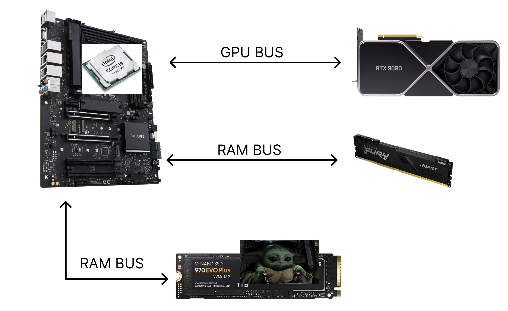
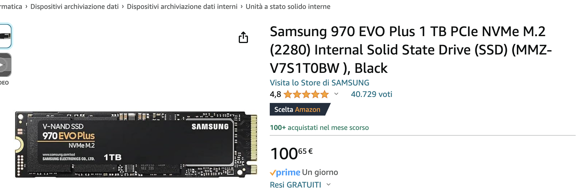
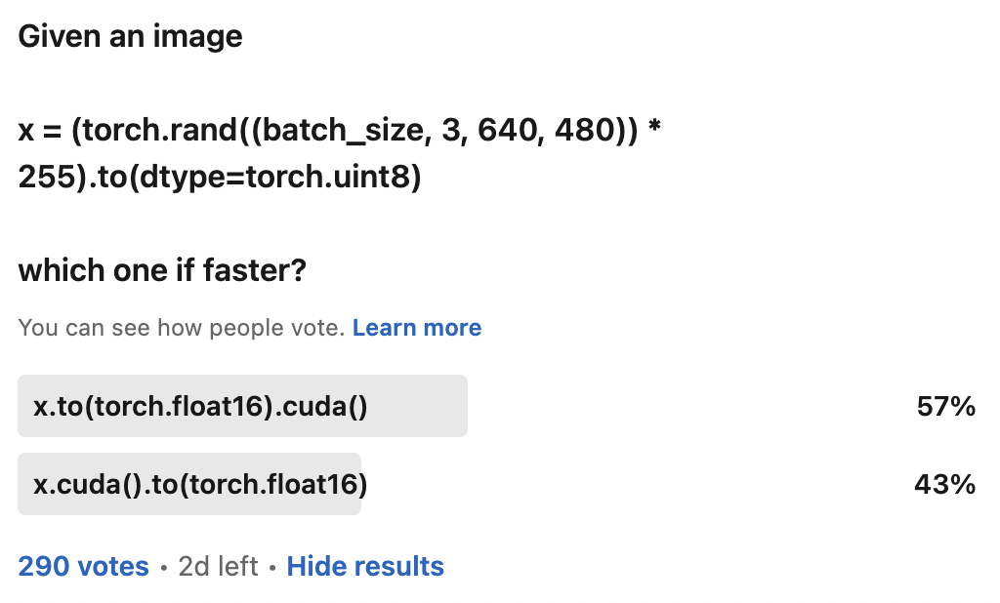
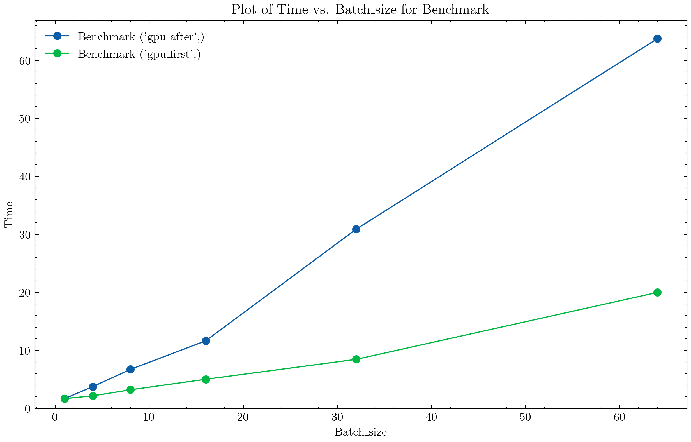
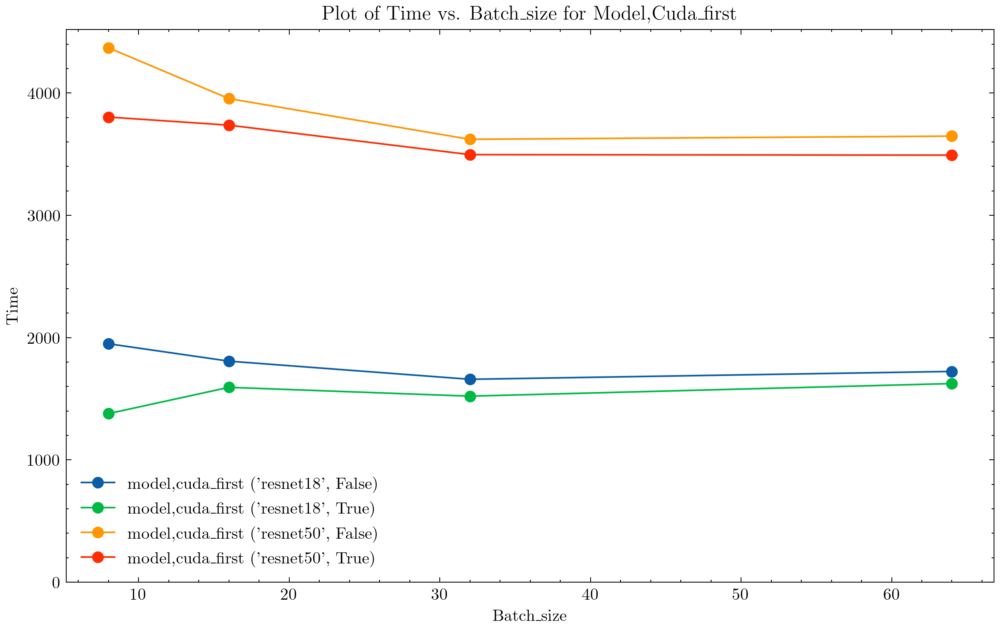
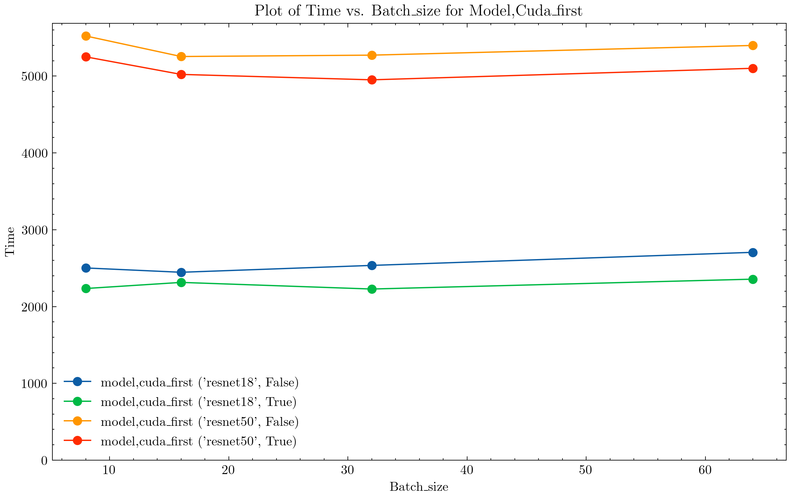
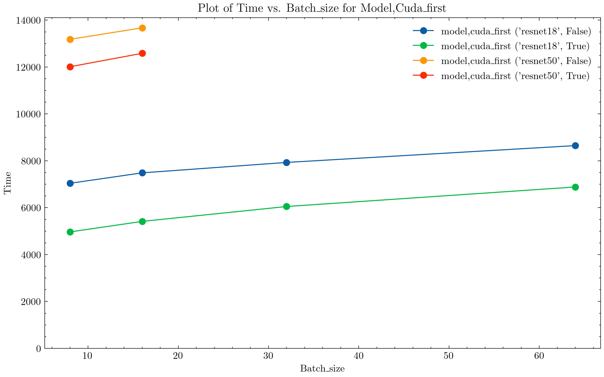

# How to Efficiently Send Images to GPU 📸 🚀

Made with 💜 by Francesco Saverio Zuppichini

---
layout: default
---

# Me 
Senior Full Stack Machine Learning Engineer @Zurich Insurance

<div class="flex flex-col gap-1 items-center justify-center mt-20">
  
  <div class="flex gap-8 items-center justify-center mt-4">
    
    
    
    
    
  </div>
</div>

<a href="https://www.linkedin.com/in/francesco-saverio-zuppichini-94659a150/">Find me on LI</a>

<!-- Footer -->
[^1]:[Learn More](https://sli.dev/guide/syntax.html#line-highlighting)

---
layout: default
---
# Table of contents

<Toc minDepth="1" maxDepth="1"></Toc>

---
layout: default
---
# Goals

What are we going to learn?
- 🚧 **Bottlenecks** - Finding bottleneck in our pipeline
- 📊 **Benchmark** - Let's review how to benchmark PyTorch
- 💾 **Memory Optimization** - What happens when we load images into RAM? 
- 🔢 **Data Type** - Which data type should I use?
- 🛠️ **Augmentations** - CPU, GPU or both?

<small> emoji made by our lord GPT-4</small>

---
layout: default
---

# 🚧 Bottlenecks
What happens when we load images?

<div class="flex  gap-1 items-center justify-center" >
  
</div>

---
layout: default
---

## Loading from Disk
What to do?

- get a fast disk (they are cheap now xD)
- avoid opening too many file pointers
- some tasks (object detections) comes with image/labels file pairs

<div class="flex  gap-1 items-center justify-center mt-8" v-click>
  
</div>

<p v-click> we'll see how we can just have one file an `memmap` it u.u </p>


---
layout: default
---

## Memory
What to do?

- prob the best thing to optimize
- we want to reduce page fault
- we want to have contigous virtual memory allocation

<p v-click> WTF is a `page`, what is `virtual memory`🤔 </p>

---
layout: default
---

### Memory - Review
Let's review some system programming stuff hehehe

- prob the best thing to optimize
- we want to reduce page fault
- we want to have contigous virtual memory allocation

<p v-click> WTF is a `page`, what is `virtual memory`🤔 </p>
---
layout: default
---

### Memory
What happens when we load images?

---
layout: default
---

# 📊 Benchmark
How to benchmark in PyTorch?

---
layout: default
---
 
# 🔢 Data Type

Which data type? `uint8` or `float16`, which image quality?

---
layout: default
---
 
## `uint8`
Should I convert to `float16` before or after I send it to GPU?

```python {1|3|5|7|all} 
x = torch.rand((batch_size, 3, 640, 480) * 255).to(torch.uint8)
# better doing this, thanks Vincent 💜
x = torch.zeroes((batch_size, 3, 640, 480), dtype=torch.uint8).random_()
# then, it is better convert it and sending to gpu
x.half().cuda()
# or viceversa?
x.cuda().half()
```

<p v-click>Raise your hand for <pre class="inline-block">x.half().cuda()</pre></p>
<p v-click>Raise your hand for <pre class="inline-block">x.cuda().half()</pre></p>
<h3 v-click>🤔🤔🤔🤔🤔🤔</h3>
<h1 v-click>🤔🤔🤔🤔🤔🤔</h1>

---
layout: default
---

## `uint8`
I've asked people

<div class="flex  gap-1 items-center justify-center" >
  
</div>


---
layout: default
---

## `uint8`
Then benchmark it

<div class="flex  gap-1 items-center justify-center" >
  
</div>

---
layout: default
---

## `uint8`
So it is faster

<p v-click>Yes but in reality we do stuff while we run the model</p>
<p v-click> So, let's get a `Dataset` </p>
<div v-click>

```python
class DummyDataset(Dataset):
    def __init__(self, num_images: int, img_size: Tuple[int, int]):
        self.num_images = num_images
        self.img_size = img_size

    def __getitem__(self, index: int) -> Tuple[torch.Tensor, torch.Tensor]:
        img = (torch.rand((3, *self.img_size)) * 255).to(dtype=torch.uint8)
        label = torch.tensor(1)
        return img, label

    def __len__(self) -> int:
        return self.num_images
```

</div>

---
layout: default
---

## `uint8`
Some training code, `mixed precision` oc 😎

```python {all|26,27|37,38,39|30,31|32,33|all}{lines:true,startLine:5,maxHeight:'40vh'}
def run_model_train(
    ds: Dataset,
    batch_size: int,
    model: nn.Module,
    cuda_first: bool = True,
    num_epoches: int = 1,
    do_warmup: bool = True,
):
    model = model.cuda()
    optimizer = optim.SGD(model.parameters(), lr=0.001, momentum=0.9)
    scaler = GradScaler()

    dl = DataLoader(
        ds, batch_size=batch_size, num_workers=min(batch_size, 8), pin_memory=True
    )
    criterion = nn.CrossEntropyLoss()
    if do_warmup:
        run_model_train(
            ds, batch_size, model, cuda_first, num_epoches=4, do_warmup=False
        )

    with get_torch_profiler() as prof:
        with record_function("run_model_train"):
            for _ in range(num_epoches):
                for images, labels in dl:
                    if cuda_first:
                        images = images.cuda().half()
                    else:
                        images = images.half().cuda()
                    labels = labels.cuda()
                    optimizer.zero_grad()

                    with autocast(device_type="cuda", dtype=torch.float16):
                        outputs = model(images)
                        loss = criterion(outputs, labels)

                    scaler.scale(loss).backward()
                    scaler.step(optimizer)
                    scaler.update()
                end = perf_counter()
    return prof
```

---
layout: default
---

## `uint8`
```python
IMAGE_SIZES = [(384, 384), (640, 480), (1280, 960)]
BATCH_SIZES = [8, 16, 32, 64]
NUM_EPOCHES = 10
```
<div class="flex flex-col  gap-1 items-center justify-center">
  <div class="flex  gap-1 items-center justify-center">
    
    
  </div>
</div>
---
layout: default
---

## `uint8`
The bigger the image the bigger the difference

<div class="flex flex-col  gap-1 items-center justify-center">
  <div class="flex  gap-1 items-center justify-center">
    
  </div>
</div>
---
layout: default
---
## Image Quality

Let's reduce the quality

```bash
# quality between 0 and 31, good between 2-5, we are sticking with 3 
ffmpeg -i "$file" -q:v 3 "$DEST_DIR/${filename}.jpg"
```

We went from `3.5MB` to `207KB`. Can you spot the difference? 🕵️‍♂️

<div class="flex  gap-1 items-center justify-center mt-8">
  
  
</div>

---
layout: default
---
### Dataset

Let's get a `Dataset`

```python
class FolderDataset(Dataset):
    def __init__(self, src: Path):
        self.src = src 
        self.files = list(src.glob("*"))

    def __getitem__(self, index) -> Tuple[torch.Tensor, torch.Tensor]:
        img = read_image(str(self.files[index]))
        label = torch.tensor(1)
        return img, label

    def __len__(self) -> int:
        return len(self.files)
```

and check the throughput for `.png` and `.jpeg`

---
layout: default
---
 
# Code

Use code snippets and get the highlighting directly, and even types hover![^1]

```ts {all|5|7|7-8|10|all} 
// TwoSlash enables TypeScript hover information
// and errors in markdown code blocks
// More at https://shiki.style/packages/twoslash

import { computed, ref } from 'vue'

const count = ref(0)
const doubled = computed(() => count.value * 2)

doubled.value = 2
```
---
layout: default
---
 
# Image
bla

<div class="flex items-center justify-center mt-20">

</div>