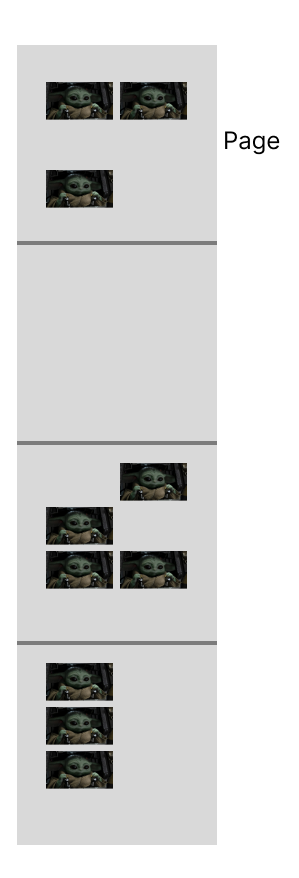
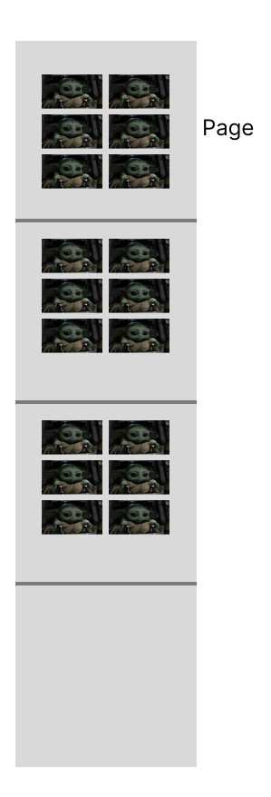
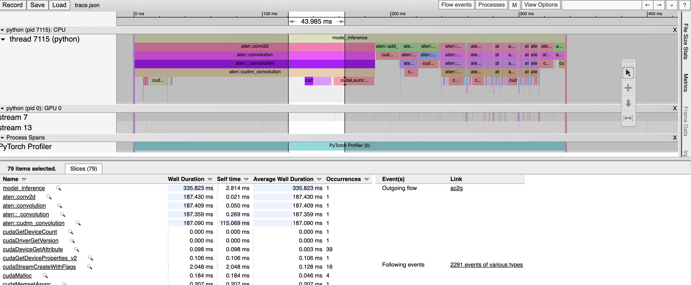
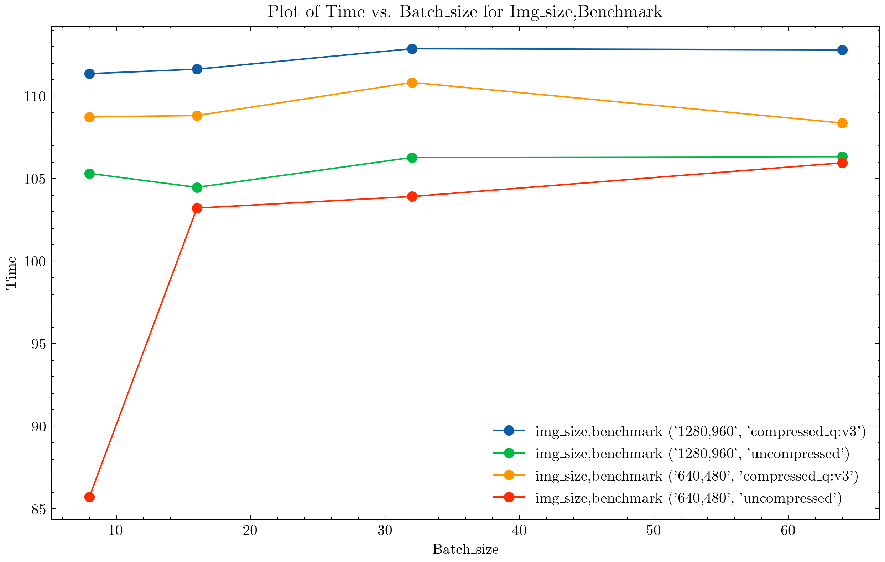
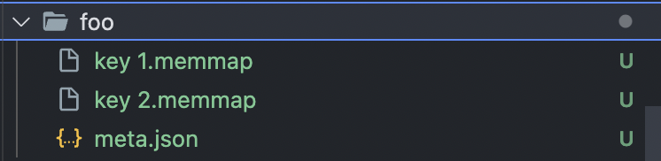

# How to Efficiently Send Images to GPU 📸 🚀

Made with 💜 by Francesco Saverio Zuppichini

---
layout: default
---

# Me 
Senior Full Stack Machine Learning Engineer @Zurich Insurance

<div class="flex flex-col gap-1 items-center justify-center mt-20">
  
  <div class="flex gap-8 items-center justify-center mt-4">
    
    
    
    
    
  </div>
</div>

<a href="https://www.linkedin.com/in/francesco-saverio-zuppichini-94659a150/">Find me on LI</a>

<!-- Footer -->
[^1]:[Learn More](https://sli.dev/guide/syntax.html#line-highlighting)

---
layout: default
---
# Table of contents

<Toc minDepth="1" maxDepth="1"></Toc>

---
layout: default
---
# Goals

What are we going to learn?
- 🚧 **Bottlenecks** - Finding bottleneck in our pipeline
- 📊 **Benchmark** - Let's review how to benchmark PyTorch
- 🔢 **Data Type** - Which data type should I use?
- 💾 **Memory Optimization** - What happens when we load images into RAM? 
- 🛠️ **Augmentations** - CPU, GPU or both?

<small> emoji made by our lord GPT-4</small>

---
layout: default
---

# 🚧 Bottlenecks
What happens when we load images?

<div class="flex  gap-1 items-center justify-center" >
  
</div>

---
layout: default
---

## Loading from Disk
What to do?

- get a fast disk (they are cheap now xD)
- avoid opening too many file pointers
- some tasks (object detections) comes with image/labels file pairs

<div class="flex  gap-1 items-center justify-center mt-8" v-click>
  
</div>

<p v-click> we'll see how we can just have one file an `memmap` it u.u </p>


---
layout: default
---

## Memory
What to do?

- prob the best thing to optimize
- we want to reduce page fault
- we want to have contigous virtual memory allocation

<p v-click> WTF is a `page`, what is `virtual memory`🤔 </p>

---
layout: default
---

### Memory - Review
Let's review some system programming stuff hehehe

<div v-click>
<h4 class="font-semibold">Page</h4>
A page is a fixed-length contiguous block of virtual memory that represents the smallest unit of data for memory management in a virtual memory system
</div>

<div v-click>
<h4 class="font-semibold">Virtual memory</h4>
Virtual memory is an abstraction of the computer's memory management system that allows an operating system to use both physical RAM and disk space to simulate a larger amount of memory, providing applications with more memory than is physically available on the system
</div>

<p v-click>OS will able to do page caching and access pattern optimization</p>

---
layout: default
---

### Memory

With normal `PyTorch`, we don't really take advantage of continous virtual memory

<div class="flex items-center justify-center">
  
</div>

---
layout: default
---

### Memory
If we `memmap` a file with all the images, in theory yes

<div class="flex items-center justify-center">
  
</div>

---
layout: default
---

# 📊 Benchmark
How to benchmark in PyTorch?

```python {all|6,7|9,10,11|13|14|17,18,19,20,21,22,23|24,25,26|all}{lines:true,maxHeight:'70%'}
import torch
import torchvision.models as models
from torch.profiler import profile, record_function, ProfilerActivity
from torch.profiler import schedule

model = models.resnet18().cuda()
inputs = torch.randn(5, 3, 224, 224).cuda()

with profile(activities=[ProfilerActivity.CPU, ProfilerActivity.CUDA]) as prof:
    with record_function("model_inference"):
        model(inputs)

print(prof.key_averages(group_by_input_shape=True).table(sort_by="cpu_time_total", row_limit=10))
prof.export_chrome_trace("trace.json")

# you can also create a schedule
my_schedule = schedule(
    skip_first=10,
    wait=5,
    warmup=1,
    active=3,
    repeat=2)

with profile(activities=[ProfilerActivity.CPU, ProfilerActivity.CUDA], schedule=my_schedule) as prof:
    with record_function("model_inference"):
        model(inputs)
```

<a href="https://pytorch.org/tutorials/recipes/recipes/profiler_recipe.html">Documentation</a>

---
layout: default
---
## 📊 Benchmark
Specify more `record_function`

```python {all|5,6|all}{lines:true,maxHeight:'40vh'}
model = models.resnet18().cuda()
inputs = torch.randn(5, 3, 224, 224)

with profile(activities=[ProfilerActivity.CPU, ProfilerActivity.CUDA]) as prof:
    with record_function("inputs_to_cuda"):
        inputs = inputs.cuda()
    with record_function("model_inference"):
        model(inputs)

print(
    prof.key_averages(group_by_input_shape=True).table(
        sort_by="cpu_time_total", row_limit=10
    )
)
prof.export_chrome_trace("trace2.json")
```
---
layout: default
---

## 📊 Benchmark
How to benchmark in PyTorch?

Trace in `chrome://tracing`

<div class="flex items-center justify-center">

</div>
---
layout: default
---
 
# 🔢 Data Type

Which data type? `uint8` or `float16`, which image quality?

---
layout: default
---
 
## `uint8`
Should I convert to `float16` before or after I send it to GPU?

```python {1|3|5|7|all} 
x = torch.rand((batch_size, 3, 640, 480) * 255).to(torch.uint8)
# better doing this, thanks Vincent 💜
x = torch.zeroes((batch_size, 3, 640, 480), dtype=torch.uint8).random_()
# then, it is better convert it and sending to gpu
x.half().cuda()
# or viceversa?
x.cuda().half()
```

<p v-click>Raise your hand for <pre class="inline-block">x.half().cuda()</pre></p>
<p v-click>Raise your hand for <pre class="inline-block">x.cuda().half()</pre></p>
<h3 v-click>🤔🤔🤔🤔🤔🤔</h3>
<h1 v-click>🤔🤔🤔🤔🤔🤔</h1>

---
layout: default
---

## `uint8`
I've asked people

<div class="flex  gap-1 items-center justify-center" >
  
</div>


---
layout: default
---

## `uint8`
Then benchmark it

<div class="flex  gap-1 items-center justify-center" >
  
</div>

---
layout: default
---

## `uint8`
So it is faster

<p v-click>Yes but in reality we do stuff while we run the model</p>
<p v-click> So, let's get a `Dataset` </p>
<div v-click>

```python
class DummyDataset(Dataset):
    def __init__(self, num_images: int, img_size: Tuple[int, int]):
        self.num_images = num_images
        self.img_size = img_size

    def __getitem__(self, index: int) -> Tuple[torch.Tensor, torch.Tensor]:
        img = (torch.rand((3, *self.img_size)) * 255).to(dtype=torch.uint8)
        label = torch.tensor(1)
        return img, label

    def __len__(self) -> int:
        return self.num_images
```

</div>

---
layout: default
---

## `uint8`
Some training code, `mixed precision` oc 😎

```python {all|26,27|37,38,39|30,31|32,33|all}{lines:true,startLine:5,maxHeight:'40vh'}
def run_model_train(
    ds: Dataset,
    batch_size: int,
    model: nn.Module,
    cuda_first: bool = True,
    num_epoches: int = 1,
    do_warmup: bool = True,
):
    model = model.cuda()
    optimizer = optim.SGD(model.parameters(), lr=0.001, momentum=0.9)
    scaler = GradScaler()

    dl = DataLoader(
        ds, batch_size=batch_size, num_workers=min(batch_size, 8), pin_memory=True
    )
    criterion = nn.CrossEntropyLoss()
    if do_warmup:
        run_model_train(
            ds, batch_size, model, cuda_first, num_epoches=4, do_warmup=False
        )

    with get_torch_profiler() as prof:
        with record_function("run_model_train"):
            for _ in range(num_epoches):
                for images, labels in dl:
                    if cuda_first:
                        images = images.cuda().half()
                    else:
                        images = images.half().cuda()
                    labels = labels.cuda()
                    optimizer.zero_grad()

                    with autocast(device_type="cuda", dtype=torch.float16):
                        outputs = model(images)
                        loss = criterion(outputs, labels)

                    scaler.scale(loss).backward()
                    scaler.step(optimizer)
                    scaler.update()
                end = perf_counter()
    return prof
```

---
layout: default
---

## `uint8`
```python
IMAGE_SIZES = [(384, 384), (640, 480), (1280, 960)]
BATCH_SIZES = [8, 16, 32, 64]
NUM_EPOCHES = 10
```
<div class="flex flex-col  gap-1 items-center justify-center">
  <div class="flex  gap-1 items-center justify-center">
    
    
  </div>
</div>
---
layout: default
---

## `uint8`
The bigger the image the bigger the difference

<div class="flex flex-col  gap-1 items-center justify-center">
  <div class="flex  gap-1 items-center justify-center">
    
  </div>
</div>

---
layout: default
---
## `uint8`
What about data augmentation?

```python {all|4|5,6,7,8,9|10,11|all}
import torch
import torchvision.transforms as T 

x = torch.zeros((4, 3, 256, 256), dtype=torch.uint8)
# they don't usually change the dtype, expecially if they just move pixels
print(T.RandomCrop((224, 225))(x).dtype) # torch.uint8
print(T.Resize((224, 225))(x).dtype) # torch.uint8
print(T.RandomRotation(degrees=45)(x).dtype) # torch.uint8
print(T.GaussianBlur(kernel_size=3)(x).dtype) # torch.uint8
# but normalisation does it, you need to pass float
print(T.Normalize(mean=[0.485,0.456,0.406], std=[0.229,0.224,0.225])(x.half()).dtype) # torch.float16
```
<p v-click>
Btw `PyTorch` transformations now support batches, if you pass a `torch.tensor`, they are just pytorch code and you can also export them with `onnx` - gg their engineers!
</p>

---
layout: default
---
## `uint8`
So what to do?

<div v-click>
Add normalisation in your model, also make it easier prod with `onnx` xD

```python
from torch import nn 
from torchvision.models import resnet18

model = nn.Sequential(T.Normalize(mean=[0.485,0.456,0.406], std=[0.229,0.224,0.225]), resnet18()).half().cuda()
# nn.Sequential is life, nn.Sequential is love
print(model(x.cuda().half()).size()) # torch.Size([4, 1000])
# if you export the model to onnx, gg you don't need to add weird code to normalise
```
</div>
---
layout: default
---

## Answers

- ✅ `uint8`
- ✅  normalise on the model

<p v-click> What about image quality? </p>

---
layout: default
---
## Image Quality

Let's reduce the quality

```bash
# quality between 0 and 31, good between 2-5, we are sticking with 3 
ffmpeg -i "$file" -q:v 3 "$DEST_DIR/${filename}.jpg"
```

We went from `3.5MB` to `207KB`. Can you spot the difference? 🕵️‍♂️

<div class="flex  gap-1 items-center justify-center mt-8">
  
  
</div>

---
layout: default
---
### Dataset

Let's get a `Dataset`

```python
class FolderDataset(Dataset):
    def __init__(self, src: Path):
        self.src = src 
        self.files = list(src.glob("*"))

    def __getitem__(self, index) -> Tuple[torch.Tensor, torch.Tensor]:
        img = read_image(str(self.files[index]))
        label = torch.tensor(1)
        return img, label

    def __len__(self) -> int:
        return len(self.files)
```

---
layout: default
---
### Dataset
and check the throughput for `uncompressed` and `compressed`
<div class="flex  gap-1 items-center justify-center mt-8">
  
</div>

---
layout: default
---
 
# Memory Optimization
Can we optimise memory?

Let' use `TensorDict`(made with 💜 by <a href="https://www.linkedin.com/in/vincent-moens-9bb91972/">Vincent Moens</a>)

```python {all|1|4,5,6,7,8,9,10|all}{maxHeight:'60%'}
from tensordict import TensorDict
import torch

data = TensorDict(
    {
        "key 1": torch.ones(3, 4, 5),
        "key 2": torch.zeros(3, 4, 5, dtype=torch.bool),
    },
    batch_size=[3, 4],
)
print(data)
# TensorDict(
#     fields={
#         key 1: Tensor(shape=torch.Size([3, 4, 5]), device=cpu, dtype=torch.float32, is_shared=False),
#         key 2: Tensor(shape=torch.Size([3, 4, 5]), device=cpu, dtype=torch.bool, is_shared=False)},
#     batch_size=torch.Size([3, 4]),
#     device=None,
#     is_shared=False)

```

<a href="https://github.com/pytorch/tensordict">Documentation</a>

---
layout: default
---
 
## Memory Optimization
We can `memmap` it

```python
data.memmap("tensors/")
```

<div class="flex flex-col gap-1 items-center justify-center mt-8">
  
</div>

---
layout: default
---
 
<div class="flex flex-col gap-1 items-center justify-center h-full">
  <h1> Thank you 💜</h1>
  
</div>